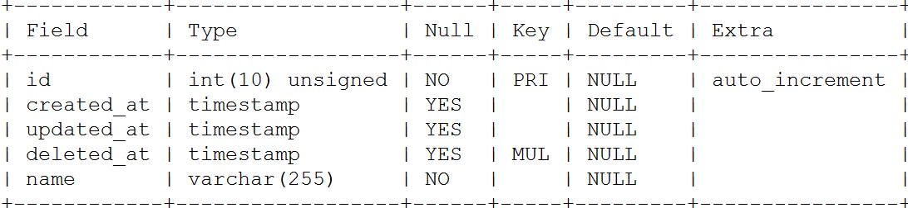

<!-- more -->

> `gorm`是go语言中实现数据库访问的`ORM（对象关系映射）库`。使用这个库，我们可以利用面向对象的方法，更加方便的对数据库中的数据进行`CRUD(增删改查)`。


#### 中文文档

[链接](<https://jasperxu.github.io/gorm-zh/models.html#md>)

#### 下载依赖

```go
go get github.com/jinzhu/gorm   		//核心库。
go get github.com/go-sql-driver/mysql	//mysql驱动包。
```

####  连接`mysql`

```go
//连接
db,err:=gorm.Open("mysql","root:123456@tcp(127.0.0.1:3306)/testdb?charset=utf8")
//设置连接数
//是否设置gorm的log打印
db.LogMode(viper.GetBool("gormlog"))
//db.DB().SetMaxOpenConns(20000) // 用于设置最大打开的连接数，默认值为0表示不限制.设置最大的连接数，可以避免并发太高导致连接mysql出现too many connections的错误。
db.DB().SetMaxIdleConns(0) // 用于设置闲置的连接数.设置闲置的连接数则当开启的一个连接使用完成后可以放在池里等候下一次使用。
```

#### 自动迁移

> `gorm`可以支持自动迁移，也就是自动的表结构迁移，只会创建表，补充缺少的列，缺少的索引。但并不会更改已经存在的列类型，也不会删除不再用的列，这样设计的目的是为了保护已存在的数据。可以同时针对多个表进行迁移设置。

当修改一个列的时候，会默认创建新的，不会更改之前的。

##### 当数据库中没有表的时候，会根据结构体自动创建表

```golang
type User struct {
	gorm.Model  //继承了gorm的model方法。默认创建了ID、CreatedAt、UpdatedAt、DeletedAt
	Name string `gorm:"not null"`
}
```

`ID`、`CreatedAt`、`UpdatedAt`、`DeletedAt`分别是：自增的id，创建该条数据的时间，更新该条数据的最新时间，删除该条数据的最后时间。

创建数据库

```
db.AutoMigrate(&User{})
```

**创建的表的名字是`struct`**名字的复试，也就是数据库中的名字是`users`

查看创建的数据库如下结构：



##### 当数据库中有表的话。

> 在很多情况下 我么是自己进行创建数据库，在使用`goorm`的

```golang
自己创建数据库的时候的语句，别忘了添加 `ID`、`CreatedAt`、`UpdatedAt`、`DeletedAt` 
CREATE TABLE tb_users(
   id INTEGER PRIMARY KEY AUTO_INCREMENT,
   username VARCHAR(200) NOT NULL,
   PASSWORD VARCHAR(200) NOT NULL,
   CreatedAt timestamp null default null,
   UpdatedAt timestamp null default null,
   DeletedAt timestamp null default null,
   UNIQUE(username)
);
```

在项目中自定义`struct`

```golang
type UserModel struct {
	BaseModel
	Username string `json:"username" gorm:"column:username;not null" binding:"required" validate:"min=1,max=32"`
	Password string `json:"password" gorm:"column:password;not null" binding:"required" validate:"min=5,max=128"`
}
```

`BaseModel `为：

和数据库中的字段相对应

```golang
type BaseModel struct {
	Id        uint     `gorm:"primary_key;AUTO_INCREMENT;column:id" json:"-"` //主键
	CreatedAt time.Time  `gorm:"column:createdAt" json:"-"`
	UpdatedAt time.Time  `gorm:"column:updatedAt" json:"-"`
	DeletedAt *time.Time `gorm:"column:deletedAt" sql:"index" json:"-"`
}
```

**关联数据库的表**

```go
//关联数据库的名字
func (UserModel *UserModel) TableName() string {
	return "tb_users"
}
```


#### 使用

##### 添加`create`

当`create`的时候默认将`CreatedAt`和`UpdatedAt`进行添加当前的时间

```golang
func main() {
	db, err := gorm.Open("mysql",
		"root:...@tcp(192.144.238.85:3306)/test?charset=utf8&loc=Asia%2FShanghai")
	if err != nil {
		fmt.Println(err)
		return
	} else {
		fmt.Println("connection succedssed")
	}
	defer db.Close()
	createAndAdd(db)
}

type User struct {
	gorm.Model
	Name string `gorm:"not null"`
}

//创建表并添加数据
func createAndAdd(db *gorm.DB) {
	db.AutoMigrate(&User{})
	user := &User{}
	err := db.Create(user).Error
	logs.Info(err)

}
```

##### 删除一条记录

```golang
user := UserModel{}
user.Id = id //指定Id
err := db.Delete(&user).Error
```

当删除数据库的记录的时候，是将数据库中的字段`DeletedAt`进行赋值，表明次条记录的删除时间。

| id   | password | CreatedAt           | UpdatedAt           | DeleteAt            | username |
| ---- | -------- | ------------------- | ------------------- | ------------------- | -------- |
| 1    | xxx...   | 2019-10-17 16:59:43 | 2019-10-17 16:59:43 | null                | name1    |
| 2    | xxx...   | 2019-10-17 17:07:03 | 2019-10-17 17:07:03 | 2019-10-17 17:07:33 | name2    |

如果删除了该条记录那么`DeleteAt`不为空

##### 更新记录

更新记录我是用的是`db.save()`设置好更新的`struct`中的`id`,需要更新的内容参数，就可以了。

```golang
	db.AutoMigrate(&User{})
	user := &User{Name: "蜡笔小新"}
	user.ID=uint(2) //指定需要更新的id号
	err := db.Save(user).Error  //更新
	logs.Info(err)
```

##### 查询记录


